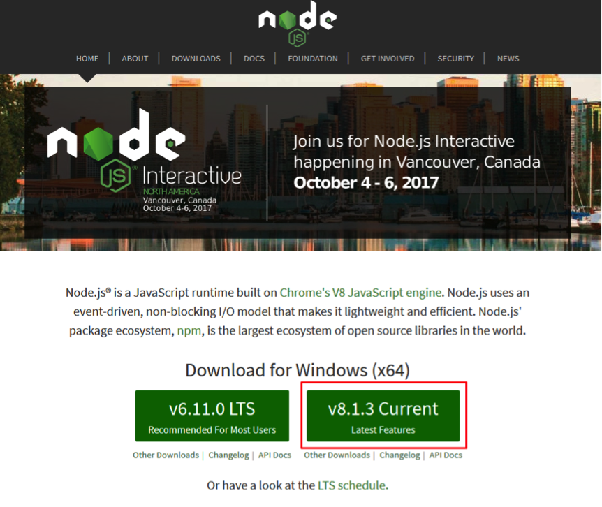
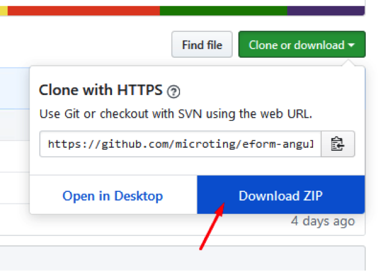
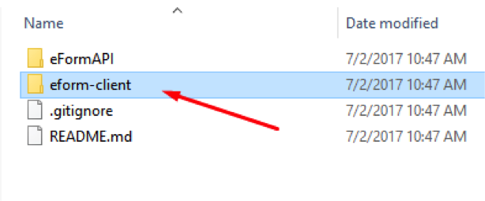
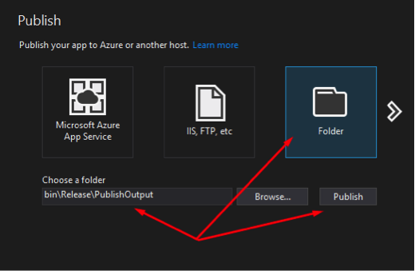
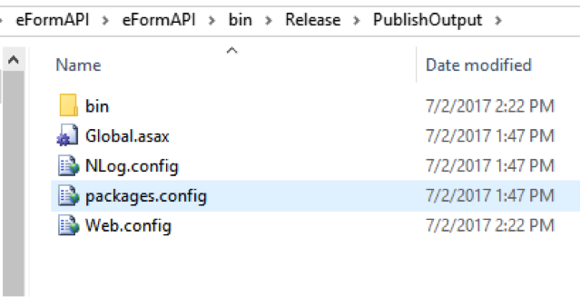
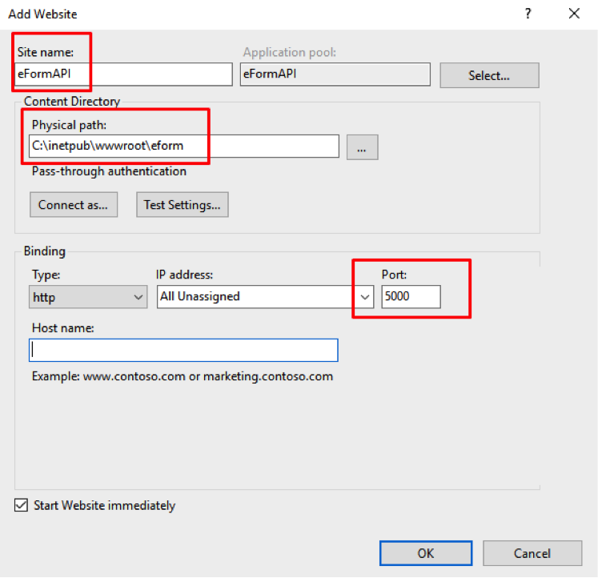
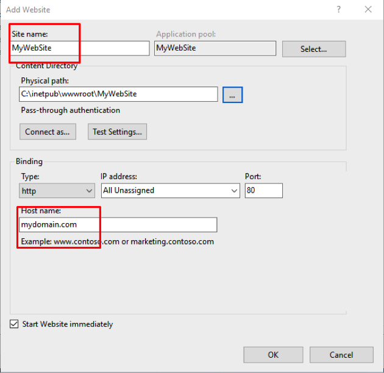
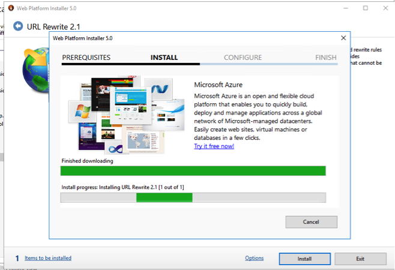
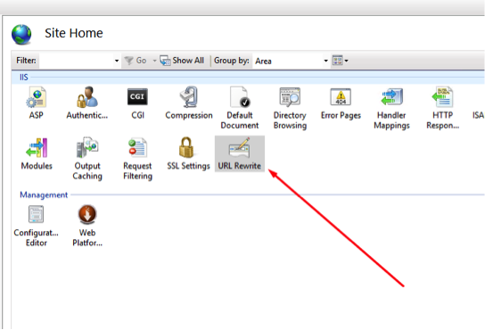
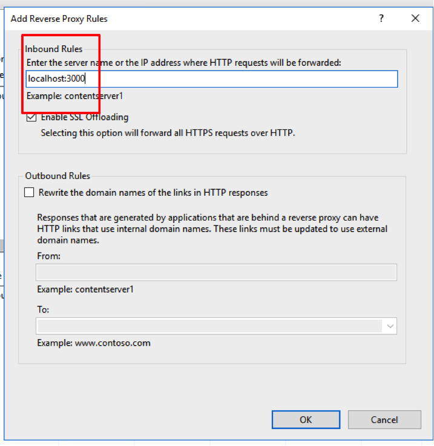

  # Installation
  
  #### 1. Node.js & npm installation
  
  1. Go to Node.js website [https://nodejs.org/en](https://nodejs.org/en)
  
  2. Download and run node.js installer
  3. Check "npm package manager" & "Add to PATH" (they should be checked by default.)
  

    
  #### 2. Downloading latest eForm Angular version
    
  1. Go go [https://github.com/microting/eform-angular-frontend](https://github.com/microting/eform-angular-frontend)
  2. Download ZIP-Archive with the latest version of application
  
  3. Extract the files
  
  #### 3. Build Angular application
  
  1. Go go Angular application folder
  
  2. Call **cmd** from your Angular folder
  
  3. Call **npm install**
  
  4. Then call **npm run build**
  
  5. Angular application has been built and extracted to **dist** folder
  
    
  #### 4. Build WEB API application
    
  1. Go to the API folder
  
  2. Open eFormAPI.sln in Visual Studio
  
  3. Press CTRL+SHIFT+B to build and restore packages
  4. Click publish for .Web project
  
  5. Select path and clich Publish
  
  6. Now you have a compiled API application
  
  
    
  #### 5. Publish WEB API application
  
  1. Install Internet Information Services if not already installed.    
        1. Press the Windows Key and type Windows Features, select the first entry "Turn Windows Feature On of Off"
        2. Check "Internet Information Services" and click OK
  2. Copy compiled files to forlder in server
  
  3. Open Internet Information Services (IIS) Manager
  
  4. Click Add Website
  
  5. Fill all required settings
  
    
  #### 6.1 Running Angular as a console application
    
  1. Go go the angular folder and run **cmd**
  2. If you did not build the application before call **npm install** and then **npm run build**
  3. Call **npm run server**
  
  4. Now application is working, don't close the command prompt when app is working (if you want to stop it - press **CTRL+C** to times)
      
  #### 6.2 Running Angular as a Windows Service
      
  1. Go to the Angular folder and type **cmd**
  
  2. install node-windows with npm, unsing the global flag
    **npm install -g node-windows**
  3. Then call **npm link node-windows**
  4. If you want to install and start the service, call **npm run winserver-install**
  
  5. Now you application has been started as a Windows Service
  
  6. If you want to stop & uninstall, call **npm run winserver-uninstall**
  
    
    
  #### 7. Binding host name to website
    
  1. Click Add Website and fill all fields in IIS Manager
  
  2. Install **URL Rewrite extension**
  [https://www.iis.net/downloads/microsoft/url-rewrite](https://www.iis.net/downloads/microsoft/url-rewrite)
  3. Install **APP Requst Routing** extension
    [https://www.iis.net/downloads/microsoft/application-request-routing](https://www.iis.net/downloads/microsoft/application-request-routing)
  
  4. Select Rewrite in your website section
  
  5. Add new rule
    
  6. Click on Reverse Proxy
  
  7. Add to rules localhost:300 (same as our angular app)
  
  8. Then go to website  
  